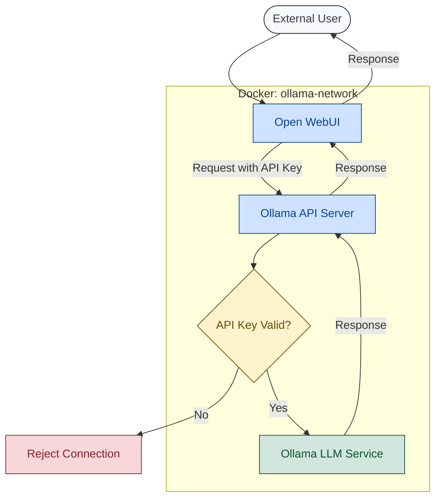

# 🦙 Ollama API Server
A simple, easy-to-use api server that sits in front of your local ollama instance to add additional security when making requests to ollama.

<a href="https://www.buymeacoffee.com/gitmotion" target="_blank" rel="noopener noreferrer">
  
</a>

## 📑 Table of Contents
- [⭐ Features](#⭐-features)
- [🎛️ Example Flow](#🎛️-example-flow)
- [🚀 Quick Start](#🚀-quick-start)
- [📖 Detailed Setup](#📖-detailed-setup)
  - [🐳 Docker Setup (Recommended)](#🐳-docker-setup-recommended)
  - [📂 Docker Image](#📂-docker-image)
  - [📄 Docker Compose Configuration](#📄-docker-compose-configuration)
  - [💻 Local Setup](#💻-local-setup)
- [⚙️ Configuration](#⚙️-configuration)
- [🔌 API Endpoints](#🔌-api-endpoints)
- [🔐 Authentication](#🔐-authentication)

## ⭐ Features
- 🔑 API Key Authentication
- 🔄 CORS Support
- 🚀 Connection Pooling
- 🌊 Streaming Support
- 🐳 Easy Docker Setup
- 🔌 All Ollama API Endpoints Supported

## 🎛️ Example Flow
- Example of connecting a local ollama instance to an open-webui docker container on the same docker network

<div align="center">
  
</div>



## 🚀 Quick Start

```bash
# 1. Create a .env file with your API keys
echo "API_KEYS=your-secret-key-1,your-secret-key-2" > .env

# 2. Start the server with Docker
docker compose up -d
```

That's it! Your secure Ollama API server is running on port 7777.

## 📖 Detailed Setup

### 🐳 Docker Setup (Recommended)

### 📂 Docker Image

The official Docker image is available on Docker Hub and GitHub Container Registry:

```bash
# Docker Hub
docker pull gitmotion/ollama-api-server:latest

# GitHub Container Registry
docker pull ghcr.io/gitmotion/ollama-api-server:latest
```

1. Clone the repository:
   ```bash
   git clone https://github.com/gitmotion/ollama-api-server.git
   cd ollama-api-server
   ```

2. Create a .env file:
   ```bash
   cp .env.example .env
   ```

3. Edit the .env file with your preferred settings:
   ```env
   PORT_EXTERNAL=7777
   OLLAMA_BASE_URL=http://localhost:11434
   CORS_ORIGIN=*
   API_KEYS=your-secret-key-1,your-secret-key-2
   ```

4. Start the server:
   ```bash
   docker compose up -d
   ```

### 📄 Docker Compose Configuration

The server uses the following `docker-compose.yml` configuration:

```yaml
services:
  api:
    image: gitmotion/ollama-api-server:latest
    container_name: ollama-api-server
    restart: unless-stopped
    ports:
      - "${PORT_EXTERNAL:-7777}:7777"
    environment:
      - PORT=7777
      - OLLAMA_BASE_URL=http://internal-ip-where-ollama-installed:11434 # must serve your ollama server with 0.0.0.0
      - CORS_ORIGIN=*
      - API_KEYS=${API_KEYS:-default-key-1,default-key-2}
```

#### Example of ollama-api-server with your open-webui stack:
```yaml
services:
  ollama-api-server:
    image: gitmotion/ollama-api-server:latest
    container_name: ollama-api-server
    restart: unless-stopped
    ports:
      - "${PORT_EXTERNAL:-7777}:7777"
    environment:
      - PORT=7777
      - OLLAMA_BASE_URL=http://internal-ip-where-ollama-installed:11434 # must serve your ollama server with 0.0.0.0
      - CORS_ORIGIN=*
      - API_KEYS=${API_KEYS:-secure-api-key-1,secure-api-key-2} # UPDATE THESE KEYS - comma separated
    networks:
      - ollama-network

  open-webui:
    image: openwebui/open-webui:latest
    container_name: open-webui
    restart: unless-stopped
    depends_on:
      - ollama-api-server
    ports:
      - "3000:3000"
    environment:
      - OLLAMA_BASE_URL=http://ollama-api-server:7777 # Configure the api key via UI
      - WEBUI_SECRET_KEY=${WEBUI_SECRET_KEY}
    volumes:
      - ./open-webui-data:/app/backend/data
    networks:
      - ollama-network
      - your-external-reverse-proxy

networks:
  ollama-network:
    driver: bridge
  your-external-reverse-proxy:
    external: true
```

This configuration:
- Uses the official Docker image
- Maps the container's port 7777 to your host's port (configurable via PORT_EXTERNAL)
- Sets up the required environment variables
- Provides default API keys if none are specified

You can customize the configuration by:
1. Changing the external port (PORT_EXTERNAL in .env)
2. Setting your API keys (API_KEYS in .env)
3. Modifying the Ollama base URL if needed
4. Adjusting CORS settings for your environment

### 💻 Local Setup

1. Clone the repository:
   ```bash
   git clone https://github.com/gitmotion/ollama-api-server.git
   cd ollama-api-server
   ```

2. Install dependencies:
   ```bash
   npm install
   ```

3. Create and configure .env file:
   ```bash
   cp .env.example .env
   # Edit .env with your settings
   ```

4. Build and start the server:
   ```bash
   npm run build
   npm start
   ```

## ⚙️ Configuration

The server can be configured using environment variables:

| Variable | Description | Default |
|----------|-------------|---------|
| PORT | Server port | 7777 |
| OLLAMA_BASE_URL | URL of your Ollama instance | http://localhost:11434 |
| CORS_ORIGIN | CORS origin setting | * |
| API_KEYS | Comma-separated list of valid API keys | default-key-1,default-key-2 |

## 🔌 API Endpoints

All Ollama API endpoints are supported with authentication:

- `POST /api/chat` - Chat completion
- `POST /api/generate` - Text generation
- `POST /api/embeddings` - Generate embeddings
- `GET /api/tags` - List available models
- `POST /api/show` - Show model details
- `POST /api/pull` - Pull a model
- `DELETE /api/delete` - Delete a model
- `POST /api/copy` - Copy a model
- `GET /api/version` - Get Ollama version
- `GET /health` - Health check endpoint

## 🔐 Authentication

Include your API key in requests using one of these methods:

1. X-API-Key header:
   ```bash
   curl -H "x-api-key: your-api-key" http://localhost:7777/api/tags
   ```

2. Authorization header:
   ```bash
   curl -H "Authorization: Bearer your-api-key" http://localhost:7777/api/tags
   ```

3. Request body:
   ```bash
   curl -X POST -H "Content-Type: application/json" \
        -d '{"apiKey": "your-api-key"}' \
        http://localhost:7777/api/tags
   ```

For the latest version and updates, check out our GitHub repository.

___

Made with ❤️ by [gitmotion](https://github.com/gitmotion)